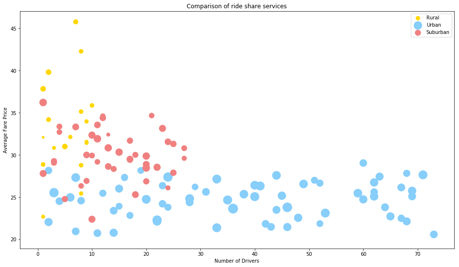
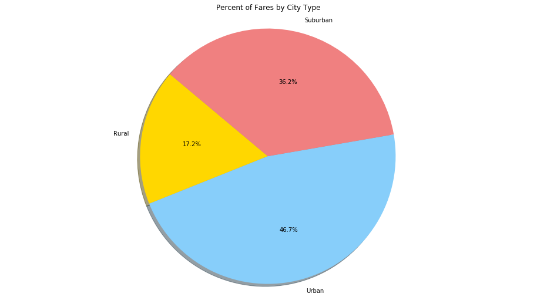
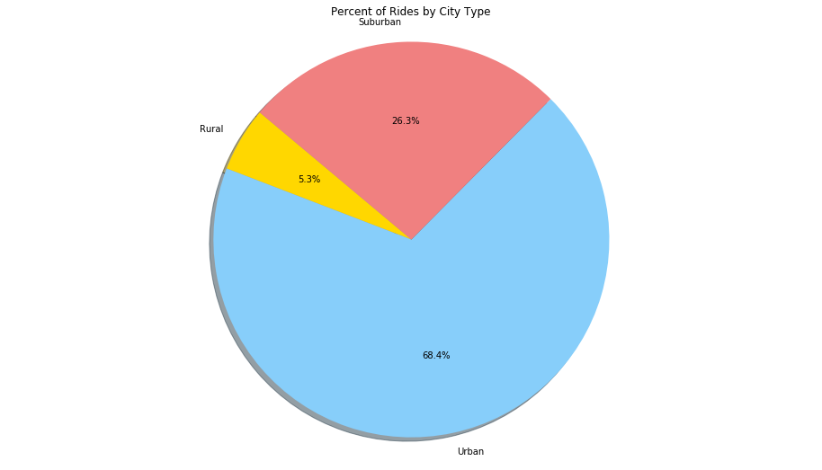
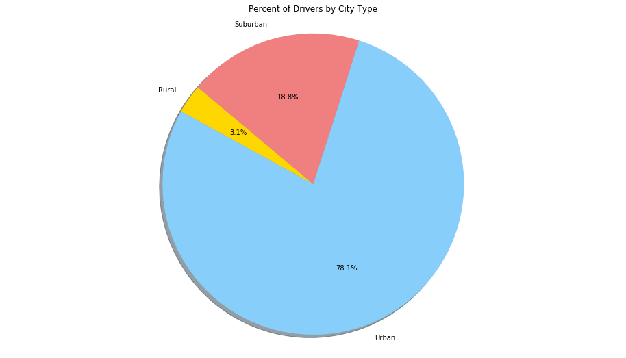

```python
import matplotlib.pyplot as plt
import numpy as np
import csv
import pandas as pd
import seaborn as sns
import matplotlib.cm as cm
```


```python
driver_df1 = pd.read_csv("Data/city_data.csv")
driver_df2 = pd.read_csv("Data/ride_data.csv")

combined_ride_data = pd.merge(driver_df1, driver_df2, on="city")

combined_ride_data.head(25)
```


<div>
<style scoped>
    .dataframe tbody tr th:only-of-type {
        vertical-align: middle;
    }

    .dataframe tbody tr th {
        vertical-align: top;
    }

    .dataframe thead th {
        text-align: right;
    }
</style>
<table border="1" class="dataframe">
  <thead>
    <tr style="text-align: right;">
      <th></th>
      <th>city</th>
      <th>driver_count</th>
      <th>type</th>
      <th>date</th>
      <th>fare</th>
      <th>ride_id</th>
    </tr>
  </thead>
  <tbody>
    <tr>
      <th>0</th>
      <td>Tammyburgh</td>
      <td>11</td>
      <td>Urban</td>
      <td>2017-01-02 10:56:28</td>
      <td>12.40</td>
      <td>7963408790849</td>
    </tr>
    <tr>
      <th>1</th>
      <td>Tammyburgh</td>
      <td>11</td>
      <td>Urban</td>
      <td>2017-01-02 04:28:03</td>
      <td>18.78</td>
      <td>2315208159060</td>
    </tr>
    <tr>
      <th>2</th>
      <td>Tammyburgh</td>
      <td>11</td>
      <td>Urban</td>
      <td>2017-01-03 03:00:08</td>
      <td>30.10</td>
      <td>558639764959</td>
    </tr>
    <tr>
      <th>3</th>
      <td>Tammyburgh</td>
      <td>11</td>
      <td>Urban</td>
      <td>2017-01-01 00:10:21</td>
      <td>7.76</td>
      <td>9113511454178</td>
    </tr>
    <tr>
      <th>4</th>
      <td>Tammyburgh</td>
      <td>11</td>
      <td>Urban</td>
      <td>2017-01-02 05:22:44</td>
      <td>22.00</td>
      <td>4171010688543</td>
    </tr>
    <tr>
      <th>5</th>
      <td>Tammyburgh</td>
      <td>11</td>
      <td>Urban</td>
      <td>2017-01-02 21:29:38</td>
      <td>5.37</td>
      <td>5531485446571</td>
    </tr>
    <tr>
      <th>6</th>
      <td>Tammyburgh</td>
      <td>11</td>
      <td>Urban</td>
      <td>2017-01-02 23:58:17</td>
      <td>11.68</td>
      <td>1012442651497</td>
    </tr>
    <tr>
      <th>7</th>
      <td>Tammyburgh</td>
      <td>11</td>
      <td>Urban</td>
      <td>2017-01-02 21:10:16</td>
      <td>31.16</td>
      <td>7261786411548</td>
    </tr>
    <tr>
      <th>8</th>
      <td>Tammyburgh</td>
      <td>11</td>
      <td>Urban</td>
      <td>2017-01-02 00:43:50</td>
      <td>10.64</td>
      <td>9221421228793</td>
    </tr>
    <tr>
      <th>9</th>
      <td>Tammyburgh</td>
      <td>11</td>
      <td>Urban</td>
      <td>2017-01-01 12:39:10</td>
      <td>9.88</td>
      <td>6250336876297</td>
    </tr>
    <tr>
      <th>10</th>
      <td>Tammyburgh</td>
      <td>11</td>
      <td>Urban</td>
      <td>2017-01-01 14:13:26</td>
      <td>23.97</td>
      <td>851102797493</td>
    </tr>
    <tr>
      <th>11</th>
      <td>Tammyburgh</td>
      <td>11</td>
      <td>Urban</td>
      <td>2017-01-01 07:25:05</td>
      <td>32.90</td>
      <td>3093940598123</td>
    </tr>
    <tr>
      <th>12</th>
      <td>Tammyburgh</td>
      <td>11</td>
      <td>Urban</td>
      <td>2017-01-01 11:13:16</td>
      <td>5.94</td>
      <td>6301143210542</td>
    </tr>
    <tr>
      <th>13</th>
      <td>Tammyburgh</td>
      <td>11</td>
      <td>Urban</td>
      <td>2017-01-01 13:44:35</td>
      <td>10.27</td>
      <td>1995784061110</td>
    </tr>
    <tr>
      <th>14</th>
      <td>Tammyburgh</td>
      <td>11</td>
      <td>Urban</td>
      <td>2017-01-02 13:20:45</td>
      <td>41.04</td>
      <td>4635225467442</td>
    </tr>
    <tr>
      <th>15</th>
      <td>Tammyburgh</td>
      <td>11</td>
      <td>Urban</td>
      <td>2017-01-01 06:49:00</td>
      <td>27.48</td>
      <td>5635061147330</td>
    </tr>
    <tr>
      <th>16</th>
      <td>Tammyburgh</td>
      <td>11</td>
      <td>Urban</td>
      <td>2017-01-02 23:28:35</td>
      <td>22.43</td>
      <td>4240585503749</td>
    </tr>
    <tr>
      <th>17</th>
      <td>Tammyburgh</td>
      <td>11</td>
      <td>Urban</td>
      <td>2017-01-01 11:50:03</td>
      <td>8.40</td>
      <td>7691252503666</td>
    </tr>
    <tr>
      <th>18</th>
      <td>Tammyburgh</td>
      <td>11</td>
      <td>Urban</td>
      <td>2017-01-01 17:51:31</td>
      <td>21.39</td>
      <td>3874929768672</td>
    </tr>
    <tr>
      <th>19</th>
      <td>Tammyburgh</td>
      <td>11</td>
      <td>Urban</td>
      <td>2017-01-01 05:28:50</td>
      <td>37.84</td>
      <td>8096350011706</td>
    </tr>
    <tr>
      <th>20</th>
      <td>Tammyburgh</td>
      <td>11</td>
      <td>Urban</td>
      <td>2017-01-01 19:56:38</td>
      <td>43.11</td>
      <td>1746878188615</td>
    </tr>
    <tr>
      <th>21</th>
      <td>Tammyburgh</td>
      <td>11</td>
      <td>Urban</td>
      <td>2017-01-01 06:44:03</td>
      <td>21.27</td>
      <td>5035612751038</td>
    </tr>
    <tr>
      <th>22</th>
      <td>Melissaborough</td>
      <td>15</td>
      <td>Urban</td>
      <td>2017-01-01 08:55:58</td>
      <td>19.59</td>
      <td>2791839504576</td>
    </tr>
    <tr>
      <th>23</th>
      <td>Melissaborough</td>
      <td>15</td>
      <td>Urban</td>
      <td>2017-01-02 18:40:34</td>
      <td>17.73</td>
      <td>6817245215298</td>
    </tr>
    <tr>
      <th>24</th>
      <td>Melissaborough</td>
      <td>15</td>
      <td>Urban</td>
      <td>2017-01-02 04:37:01</td>
      <td>20.88</td>
      <td>3220484578919</td>
    </tr>
  </tbody>
</table>
</div>


```python
#All this code is probably terrible but it basically makes a nice new dataframe with all the info needed for the bubbleplot

grouped_data = combined_ride_data.groupby(['city'])['fare'].mean()

grouped_df = pd.DataFrame(grouped_data)
grouped_df = grouped_df.rename(columns={"city":"City", "fare":"Average Fare Price"})
grouped_df['Average Fare Price'] = grouped_df['Average Fare Price'].round(2)

grouped_df2 = grouped_df.reset_index()
grouped_df2 = grouped_df2.rename(columns={"city":"City"})

ride_df = pd.DataFrame(combined_ride_data['city'].value_counts())
ride_df2 = ride_df.reset_index()
ride_df2 = ride_df2.rename(columns={"index":"City", "city":"Total Rides"})

new_grouped_df = pd.merge(grouped_df2, ride_df2, on="City")

grouped_drivers = combined_ride_data.groupby(['city'])['driver_count'].mean()
drivers_df = pd.DataFrame(grouped_drivers)
drivers_df2 = drivers_df.reset_index()
drivers_df2 = drivers_df2.rename(columns={"city":"City", "driver_count":"Total Drivers"})

grouped_rides = pd.merge(new_grouped_df, drivers_df2, on="City")

city_type = combined_ride_data.groupby(['city'])['type'].first()
city_df = pd.DataFrame(city_type)
city_df2 = city_df.reset_index()
city_df2 = city_df2.rename(columns={"city":"City", "type":"City Type"})

finished_df = pd.merge(grouped_rides, city_df2, on="City")

finished_df

#grouped_rides
```


<div>
<style scoped>
    .dataframe tbody tr th:only-of-type {
        vertical-align: middle;
    }

    .dataframe tbody tr th {
        vertical-align: top;
    }

    .dataframe thead th {
        text-align: right;
    }
</style>
<table border="1" class="dataframe">
  <thead>
    <tr style="text-align: right;">
      <th></th>
      <th>City</th>
      <th>Average Fare Price</th>
      <th>Total Rides</th>
      <th>Total Drivers</th>
      <th>City Type</th>
    </tr>
  </thead>
  <tbody>
    <tr>
      <th>0</th>
      <td>Adamschester</td>
      <td>29.59</td>
      <td>9</td>
      <td>27</td>
      <td>Suburban</td>
    </tr>
    <tr>
      <th>1</th>
      <td>Alexisfort</td>
      <td>27.37</td>
      <td>33</td>
      <td>24</td>
      <td>Urban</td>
    </tr>
    <tr>
      <th>2</th>
      <td>Amberberg</td>
      <td>28.62</td>
      <td>16</td>
      <td>13</td>
      <td>Suburban</td>
    </tr>
    <tr>
      <th>3</th>
      <td>Anthonyfurt</td>
      <td>29.49</td>
      <td>17</td>
      <td>17</td>
      <td>Suburban</td>
    </tr>
    <tr>
      <th>4</th>
      <td>Boyleberg</td>
      <td>32.40</td>
      <td>5</td>
      <td>13</td>
      <td>Suburban</td>
    </tr>
    <tr>
      <th>5</th>
      <td>Brianfurt</td>
      <td>24.51</td>
      <td>22</td>
      <td>4</td>
      <td>Urban</td>
    </tr>
    <tr>
      <th>6</th>
      <td>Campbellmouth</td>
      <td>34.18</td>
      <td>8</td>
      <td>2</td>
      <td>Rural</td>
    </tr>
    <tr>
      <th>7</th>
      <td>Catherinebury</td>
      <td>27.31</td>
      <td>29</td>
      <td>7</td>
      <td>Urban</td>
    </tr>
    <tr>
      <th>8</th>
      <td>Curtismouth</td>
      <td>25.05</td>
      <td>31</td>
      <td>40</td>
      <td>Urban</td>
    </tr>
    <tr>
      <th>9</th>
      <td>Davidbury</td>
      <td>30.83</td>
      <td>20</td>
      <td>13</td>
      <td>Suburban</td>
    </tr>
    <tr>
      <th>10</th>
      <td>Davidsonfurt</td>
      <td>32.08</td>
      <td>2</td>
      <td>1</td>
      <td>Rural</td>
    </tr>
    <tr>
      <th>11</th>
      <td>East Amanda</td>
      <td>28.45</td>
      <td>21</td>
      <td>20</td>
      <td>Suburban</td>
    </tr>
    <tr>
      <th>12</th>
      <td>East April</td>
      <td>29.99</td>
      <td>16</td>
      <td>9</td>
      <td>Suburban</td>
    </tr>
    <tr>
      <th>13</th>
      <td>East James</td>
      <td>26.55</td>
      <td>28</td>
      <td>49</td>
      <td>Urban</td>
    </tr>
    <tr>
      <th>14</th>
      <td>East Jermaine</td>
      <td>26.20</td>
      <td>16</td>
      <td>29</td>
      <td>Urban</td>
    </tr>
    <tr>
      <th>15</th>
      <td>East Johnnyborough</td>
      <td>30.32</td>
      <td>20</td>
      <td>15</td>
      <td>Suburban</td>
    </tr>
    <tr>
      <th>16</th>
      <td>East Karenmouth</td>
      <td>23.78</td>
      <td>35</td>
      <td>46</td>
      <td>Urban</td>
    </tr>
    <tr>
      <th>17</th>
      <td>East Rose</td>
      <td>20.93</td>
      <td>22</td>
      <td>7</td>
      <td>Urban</td>
    </tr>
    <tr>
      <th>18</th>
      <td>Elizabethland</td>
      <td>29.86</td>
      <td>20</td>
      <td>20</td>
      <td>Suburban</td>
    </tr>
    <tr>
      <th>19</th>
      <td>Evansburgh</td>
      <td>23.48</td>
      <td>23</td>
      <td>44</td>
      <td>Urban</td>
    </tr>
    <tr>
      <th>20</th>
      <td>Fergusonburgh</td>
      <td>31.91</td>
      <td>21</td>
      <td>11</td>
      <td>Suburban</td>
    </tr>
    <tr>
      <th>21</th>
      <td>Floresbury</td>
      <td>20.77</td>
      <td>25</td>
      <td>14</td>
      <td>Urban</td>
    </tr>
    <tr>
      <th>22</th>
      <td>Gatesborough</td>
      <td>24.76</td>
      <td>14</td>
      <td>5</td>
      <td>Suburban</td>
    </tr>
    <tr>
      <th>23</th>
      <td>Hallmouth</td>
      <td>32.34</td>
      <td>19</td>
      <td>10</td>
      <td>Suburban</td>
    </tr>
    <tr>
      <th>24</th>
      <td>Heatherland</td>
      <td>31.68</td>
      <td>14</td>
      <td>17</td>
      <td>Suburban</td>
    </tr>
    <tr>
      <th>25</th>
      <td>Hillstad</td>
      <td>32.70</td>
      <td>11</td>
      <td>4</td>
      <td>Suburban</td>
    </tr>
    <tr>
      <th>26</th>
      <td>Hoganfort</td>
      <td>30.99</td>
      <td>11</td>
      <td>5</td>
      <td>Rural</td>
    </tr>
    <tr>
      <th>27</th>
      <td>Jamesbury</td>
      <td>26.31</td>
      <td>30</td>
      <td>41</td>
      <td>Urban</td>
    </tr>
    <tr>
      <th>28</th>
      <td>Jamesland</td>
      <td>28.53</td>
      <td>19</td>
      <td>22</td>
      <td>Suburban</td>
    </tr>
    <tr>
      <th>29</th>
      <td>Jillmouth</td>
      <td>21.82</td>
      <td>22</td>
      <td>42</td>
      <td>Urban</td>
    </tr>
    <tr>
      <th>...</th>
      <td>...</td>
      <td>...</td>
      <td>...</td>
      <td>...</td>
      <td>...</td>
    </tr>
    <tr>
      <th>96</th>
      <td>Robertsonhaven</td>
      <td>36.21</td>
      <td>21</td>
      <td>1</td>
      <td>Suburban</td>
    </tr>
    <tr>
      <th>97</th>
      <td>Russellfurt</td>
      <td>26.91</td>
      <td>13</td>
      <td>9</td>
      <td>Suburban</td>
    </tr>
    <tr>
      <th>98</th>
      <td>Scottside</td>
      <td>22.54</td>
      <td>26</td>
      <td>48</td>
      <td>Urban</td>
    </tr>
    <tr>
      <th>99</th>
      <td>Sheltonhaven</td>
      <td>22.67</td>
      <td>5</td>
      <td>1</td>
      <td>Rural</td>
    </tr>
    <tr>
      <th>100</th>
      <td>Smithland</td>
      <td>25.34</td>
      <td>28</td>
      <td>38</td>
      <td>Urban</td>
    </tr>
    <tr>
      <th>101</th>
      <td>Smithville</td>
      <td>25.42</td>
      <td>6</td>
      <td>8</td>
      <td>Rural</td>
    </tr>
    <tr>
      <th>102</th>
      <td>South Angela</td>
      <td>33.96</td>
      <td>6</td>
      <td>9</td>
      <td>Rural</td>
    </tr>
    <tr>
      <th>103</th>
      <td>South Brittany</td>
      <td>31.55</td>
      <td>5</td>
      <td>9</td>
      <td>Rural</td>
    </tr>
    <tr>
      <th>104</th>
      <td>South Jacobside</td>
      <td>45.77</td>
      <td>9</td>
      <td>7</td>
      <td>Rural</td>
    </tr>
    <tr>
      <th>105</th>
      <td>South John</td>
      <td>23.79</td>
      <td>18</td>
      <td>24</td>
      <td>Urban</td>
    </tr>
    <tr>
      <th>106</th>
      <td>South Lisaport</td>
      <td>33.55</td>
      <td>16</td>
      <td>11</td>
      <td>Suburban</td>
    </tr>
    <tr>
      <th>107</th>
      <td>South Mariahaven</td>
      <td>21.85</td>
      <td>17</td>
      <td>52</td>
      <td>Urban</td>
    </tr>
    <tr>
      <th>108</th>
      <td>South Mary</td>
      <td>24.73</td>
      <td>29</td>
      <td>20</td>
      <td>Urban</td>
    </tr>
    <tr>
      <th>109</th>
      <td>South Samanthafurt</td>
      <td>28.77</td>
      <td>7</td>
      <td>8</td>
      <td>Rural</td>
    </tr>
    <tr>
      <th>110</th>
      <td>South Stephen</td>
      <td>32.12</td>
      <td>6</td>
      <td>6</td>
      <td>Rural</td>
    </tr>
    <tr>
      <th>111</th>
      <td>Suzanneborough</td>
      <td>27.13</td>
      <td>30</td>
      <td>33</td>
      <td>Urban</td>
    </tr>
    <tr>
      <th>112</th>
      <td>Tammyburgh</td>
      <td>20.72</td>
      <td>22</td>
      <td>11</td>
      <td>Urban</td>
    </tr>
    <tr>
      <th>113</th>
      <td>Theresaland</td>
      <td>25.74</td>
      <td>26</td>
      <td>69</td>
      <td>Urban</td>
    </tr>
    <tr>
      <th>114</th>
      <td>Thomashaven</td>
      <td>24.72</td>
      <td>25</td>
      <td>60</td>
      <td>Urban</td>
    </tr>
    <tr>
      <th>115</th>
      <td>Turnershire</td>
      <td>26.35</td>
      <td>20</td>
      <td>23</td>
      <td>Urban</td>
    </tr>
    <tr>
      <th>116</th>
      <td>West Darrellmouth</td>
      <td>22.37</td>
      <td>18</td>
      <td>10</td>
      <td>Suburban</td>
    </tr>
    <tr>
      <th>117</th>
      <td>West Kennethland</td>
      <td>24.20</td>
      <td>21</td>
      <td>23</td>
      <td>Urban</td>
    </tr>
    <tr>
      <th>118</th>
      <td>West Lanceview</td>
      <td>22.82</td>
      <td>18</td>
      <td>17</td>
      <td>Urban</td>
    </tr>
    <tr>
      <th>119</th>
      <td>West Michaelfurt</td>
      <td>30.79</td>
      <td>12</td>
      <td>27</td>
      <td>Suburban</td>
    </tr>
    <tr>
      <th>120</th>
      <td>West Nancy</td>
      <td>26.40</td>
      <td>29</td>
      <td>40</td>
      <td>Urban</td>
    </tr>
    <tr>
      <th>121</th>
      <td>West Nathanville</td>
      <td>25.59</td>
      <td>21</td>
      <td>62</td>
      <td>Urban</td>
    </tr>
    <tr>
      <th>122</th>
      <td>West Robertchester</td>
      <td>24.57</td>
      <td>21</td>
      <td>8</td>
      <td>Urban</td>
    </tr>
    <tr>
      <th>123</th>
      <td>Whitneyfurt</td>
      <td>23.10</td>
      <td>30</td>
      <td>53</td>
      <td>Urban</td>
    </tr>
    <tr>
      <th>124</th>
      <td>Williamsonville</td>
      <td>29.07</td>
      <td>13</td>
      <td>3</td>
      <td>Suburban</td>
    </tr>
    <tr>
      <th>125</th>
      <td>Xavierborough</td>
      <td>26.32</td>
      <td>11</td>
      <td>8</td>
      <td>Suburban</td>
    </tr>
  </tbody>
</table>
<p>126 rows × 5 columns</p>
</div>


```python
rural_df = finished_df[finished_df['City Type'] == 'Rural']
suburban_df = finished_df[finished_df['City Type'] == 'Suburban']
urban_df = finished_df[finished_df['City Type'] == 'Urban']

#n = len(finished_df['City Type'])
#city_names = finished_df['City']

ride_number_r = rural_df['Total Rides']
driver_number_r = rural_df['Total Drivers']
fare_r = rural_df['Average Fare Price']     

ride_number_u = urban_df['Total Rides']
driver_number_u = urban_df['Total Drivers']
fare_u = urban_df['Average Fare Price'] 

ride_number_s = suburban_df['Total Rides']
driver_number_s = suburban_df['Total Drivers']
fare_s = suburban_df['Average Fare Price'] 

#colors=cm.rainbow(np.random.rand(n))

plt.scatter(driver_number_r, fare_r, s=ride_number_r*10, color='gold')
plt.scatter(driver_number_u, fare_u, s=ride_number_u*10, color='lightskyblue')
plt.scatter(driver_number_s, fare_s, s=ride_number_s*10, color='lightcoral')
#for i in range(n):
    #plt.annotate(city_names[i],xy=(driver_number[i],fare[i]))

plt.xlabel('Number of Drivers')
plt.ylabel('Average Fare Price')
plt.title('Comparison of ride share services')
plt.rcParams["figure.figsize"] = [16,9]

leg = plt.legend(['Rural', 'Urban', 'Suburban'])

plt.show()
```





```python
rural_total = rural_df['Average Fare Price'].sum()
urban_total = urban_df['Average Fare Price'].sum()
suburban_total = suburban_df['Average Fare Price'].sum()

fare_pie = ["Rural", "Urban", "Suburban"]
fare_pie_totals = [rural_total, urban_total, suburban_total]
pie1_colors = ["gold", "lightskyblue", "lightcoral"]
explode1 = (0, 0, 0)

plt.pie(fare_pie_totals, explode=explode1, labels=fare_pie, colors=pie1_colors,
        autopct="%1.1f%%", shadow=True, startangle=140)
plt.title('Percent of Fares by City Type')
plt.axis("equal")
```


    (-1.118204828106775,
     1.1296881607760418,
     -1.1316913129941037,
     1.1173750549353136)





```python
rural_total2 = rural_df['Total Rides'].sum()
urban_total2 = urban_df['Total Rides'].sum()
suburban_total2 = suburban_df['Total Rides'].sum()

fare_pie = ["Rural", "Urban", "Suburban"]
fare_pie_totals = [rural_total2, urban_total2, suburban_total2]
pie1_colors = ["gold", "lightskyblue", "lightcoral"]
explode1 = (0, 0, 0)

plt.pie(fare_pie_totals, explode=explode1, labels=fare_pie, colors=pie1_colors,
        autopct="%1.1f%%", shadow=True, startangle=140)
plt.title('Percent of Rides by City Type')
plt.axis("equal")
```


    (-1.117538840947629,
     1.1147685128034746,
     -1.1165950365383992,
     1.1063366004191526)





```python
rural_total3 = rural_df['Total Drivers'].sum()
urban_total3 = urban_df['Total Drivers'].sum()
suburban_total3 = suburban_df['Total Drivers'].sum()

fare_pie = ["Rural", "Urban", "Suburban"]
fare_pie_totals = [rural_total3, urban_total3, suburban_total3]
pie1_colors = ["gold", "lightskyblue", "lightcoral"]
explode1 = (0, 0, 0)

plt.pie(fare_pie_totals, explode=explode1, labels=fare_pie, colors=pie1_colors,
        autopct="%1.1f%%", shadow=True, startangle=140)
plt.title('Percent of Drivers by City Type')
plt.axis("equal")
```


    (-1.1056065671492485,
     1.1033826265715252,
     -1.1058207058352028,
     1.1167570879104152)





```python


```
